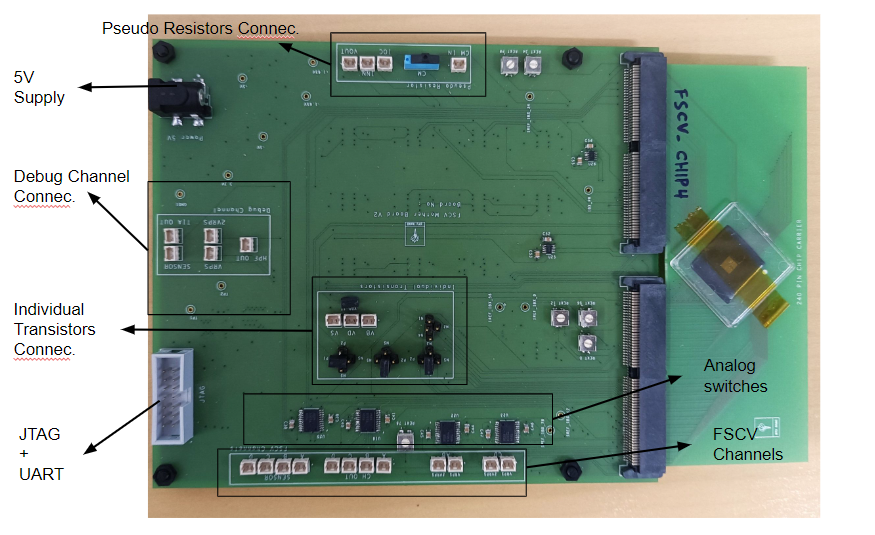
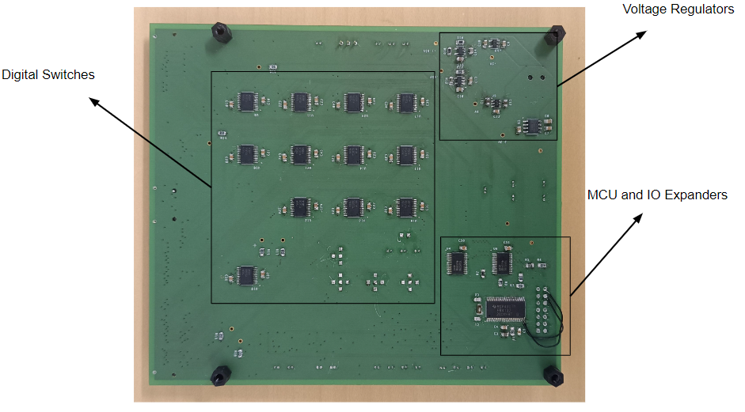
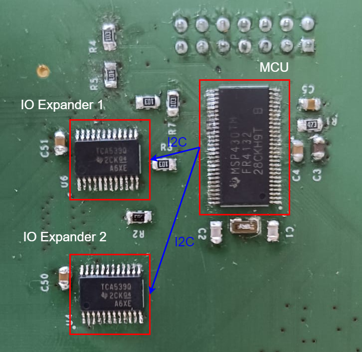
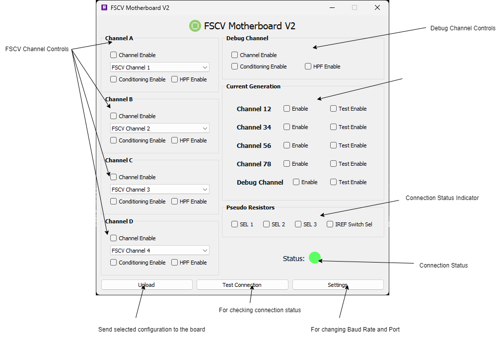

# FSCV-Multi-Channel-Chip-Readout-Board-Repository

This repository contains the PCB design files, C code for configuring the MCU, and Python code for the GUI.
## Board Overview

- **FSCV Channels**: 8
- **Layers**:
  - Top Layer: Analog Signals
  - 2nd Layer: Gnd Plane
  - 3rd Layer: Power Lines
  - Bottom Layer: Digital Signals

## Features

- **Microcontroller Control**: The board is equipped with a microcontroller to manage and control input to the IC under assessment.
- **Analog Switches**: Analog switches, controlled by the microcontroller, regulate input to the IC for precise testing.
- **JTAG Connector**: A JTAG (Joint Test Action Group) connector is provided for programming and configuring the microcontroller and for communicating with the MCU via a computer application.
- **Minimized User Intervention**: The board is designed to minimize user intervention and is intended to be placed inside a Faraday cage for a controlled testing environment.
- **GUI Application**: A Python-based GUI application is designed to interact with the board using a computer. The UART communication protocol is utilized to send information back and forth between the application and the hardware.

## Expanding IO Ports of MCU
The requirement for a higher number of switches necessitates additional output ports on the MCU to control them. Instead of selecting an MCU with more IO ports, IO expanders were used to increase the number of IO ports. In this design, two independent 16-bit IO expanders are employed, which communicate with the MCU via the I2C protocol. This approach enables the expansion of 2 IO ports to 32 independently controlled IO ports.

## GUI Development
The GUI application to control the board is designed to minimize user intervention while measuring data. Data is exchanged between the application and the MCU via a UART interface. The application, created using Python, extracts the current configuration from the GUI and sends the data to the MCU as bytes. After processing, the MCU configures its IO ports to turn on or off the analog and digital switches.

